# 药材烘干过程的热湿耦合数值模拟

本项目针对圆柱形药材的热风烘干过程，建立一维轴对称温度—水分耦合模型，计算温度与干基含水率的径向时空分布，并通过连续事件定位确定烘干终止时间。模型覆盖固定半径和实测半径收缩两类工况，提供正式 Excel 结果、数值验证、敏感性分析以及可复现图表。

## 主要结果

烘干终止条件为

$$
\max_{0\le r\le R(t)} X(r,t)\le 0.15,
$$

其中 $X$ 表示干基含水率，单位为 $\mathrm{kg\,kg^{-1}}$。

| 工况 | 几何描述 | 终止时间 / s | 终止时间 / h |
|---|---|---:|---:|
| 固定半径 | $R=2.00\ \mathrm{cm}$ | 205885.4961 | 57.1904 |
| 实测收缩 | 时变半径 $R(t)$ | 182964.6643 | 50.8235 |

固定半径工况与收缩工况采用不同的经验物性关系，因此两者的终止时间差不能完全归因于几何收缩。在相同收缩工况物性下，固定半径反事实计算的终止时间为 $129.11\ \mathrm{h}$，表明扩散路径缩短是收缩工况加速干燥的重要因素。

## 环境与几何输入

烘房温度 $T_a(t)$ 和环境水分势 $C_a(t)$ 在附件观测区间 $0\le t\le 14400\ \mathrm{s}$ 内采用分段线性插值；此后保持末端实测值

$$
T_a=50.165\ ^\circ\mathrm C,
\qquad
C_a=0.04986\ \mathrm{kg\,kg^{-1}}.
$$

<p align="center">
  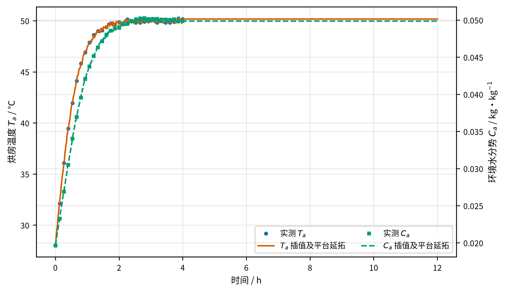
</p>
<p align="center"><strong>烘房环境的实测数据、分段线性插值与平台延拓</strong></p>

收缩半径由附件数据经 PCHIP 保形插值得到。计算前将半径从厘米换算为米，并在 $t\ge 241200\ \mathrm{s}$ 时固定为 $0.01198\ \mathrm m$。

## 数学模型

药材视为均匀、各向同性的圆柱等效介质，仅考虑径向传热与传质。温度记为 $T(r,t)$，绝对温度为

$$
\Theta=T+273.15\ \mathrm K.
$$

### 固定半径模型

在 $0<r<R_0$ 上，控制方程为

$$
\rho(X)c_p(X)\frac{\partial T}{\partial t}=
\frac{1}{r}\frac{\partial}{\partial r}
\left[rk(X)\frac{\partial T}{\partial r}\right],
$$

$$
\frac{\partial X}{\partial t}=
\frac{1}{r}\frac{\partial}{\partial r}
\left[rD_{\mathrm{eff}}(X,\Theta)\frac{\partial X}{\partial r}\right].
$$

初始条件为

$$
T(r,0)=28\ ^\circ\mathrm C,
\qquad
X(r,0)=2.55\ \mathrm{kg\,kg^{-1}}.
$$

圆柱中心满足对称条件

$$
\left.\frac{\partial T}{\partial r}\right|_{r=0}=0,
\qquad
\left.\frac{\partial X}{\partial r}\right|_{r=0}=0.
$$

表面 Robin 边界为

$$
k(X_s)\left.\frac{\partial T}{\partial r}\right|_{r=R_0}
=h_T\,[T_a(t)-T_s(t)],
$$

$$
-D_{\mathrm{eff}}(X_s,\Theta_s)
\left.\frac{\partial X}{\partial r}\right|_{r=R_0}
=h_m\,[X_s(t)-C_a(t)].
$$

### 收缩移动域模型

令

$$
\xi=\frac{r}{R(t)},
\qquad 0\le \xi\le 1.
$$

在材料坐标 $\xi$ 上，控制方程写为

$$
\rho_4(X)c_{p,4}(X)\frac{\partial T}{\partial t}=
\frac{1}{R(t)^2\xi}\frac{\partial}{\partial\xi}
\left[\xi k_4(X)\frac{\partial T}{\partial\xi}\right],
$$

$$
\frac{\partial X}{\partial t}=
\frac{1}{R(t)^2\xi}\frac{\partial}{\partial\xi}
\left[\xi D_4(X,\Theta)\frac{\partial X}{\partial\xi}\right].
$$

表面 $\xi=1$ 处满足

$$
\frac{k_4(X_s)}{R(t)}
\left.\frac{\partial T}{\partial\xi}\right|_{\xi=1}
=h_T\,[T_a(t)-T_s(t)],
$$

$$
-\frac{D_4(X_s,\Theta_s)}{R(t)}
\left.\frac{\partial X}{\partial\xi}\right|_{\xi=1}
=h_m\,[X_s(t)-C_a(t)].
$$

水分方程是以干基含水率为状态变量的经验有效扩散模型。现有输入不足以唯一确定真实水蒸气质量通量和相变潜热，因此模型不额外引入未经标定的潜热项，也不将有效通量闭合解释为设备层面的完整质量或能量守恒。

## 数值方法

- 空间离散：cell-centered 有限体积法，控制体权重与圆柱环形面积一致。
- 内部界面：变物性系数采用调和平均。
- 表面边界：半单元扩散阻力与表面对流阻力串联，等效传递系数隐式并入边界控制体。
- 时间离散：Backward Euler 启动，随后采用变步长 BDF2。
- 非线性求解：每个时间层执行 Picard 迭代，并在低含水率阶段收紧步长和按需欠松弛。
- 线性求解：调用 SciPy/LAPACK `dgtsv` 求解三对角线性系统。
- 数据对齐：时间步强制落在环境数据的 $60\ \mathrm{s}$ 节点上。
- 事件定位：监测 $g(t)=\max X(t)-0.15$，在符号改变的时间区间内二分定位连续终止时刻。
- 输出映射：将控制体中心场映射至题目指定物理半径；收缩后位于药材外部的位置保存为空值。

## 温度与含水率分布

预热阶段的温度和含水率径向剖面表现出由表面向中心传播的热湿梯度。

<p align="center">
  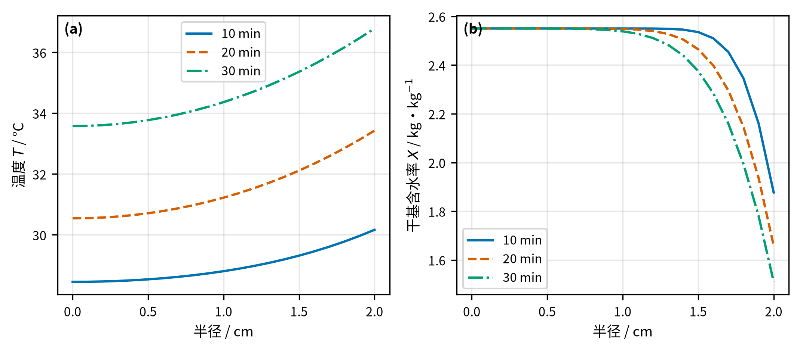
</p>
<p align="center"><strong>预热阶段温度与干基含水率径向剖面</strong></p>

<table>
<tr>
<td width="50%">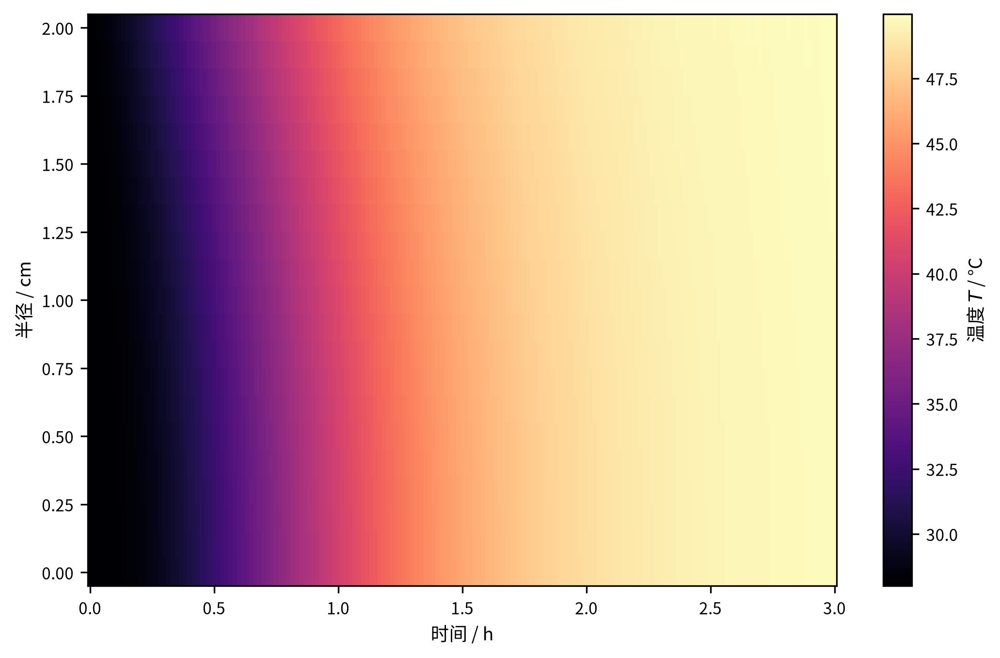</td>
<td width="50%">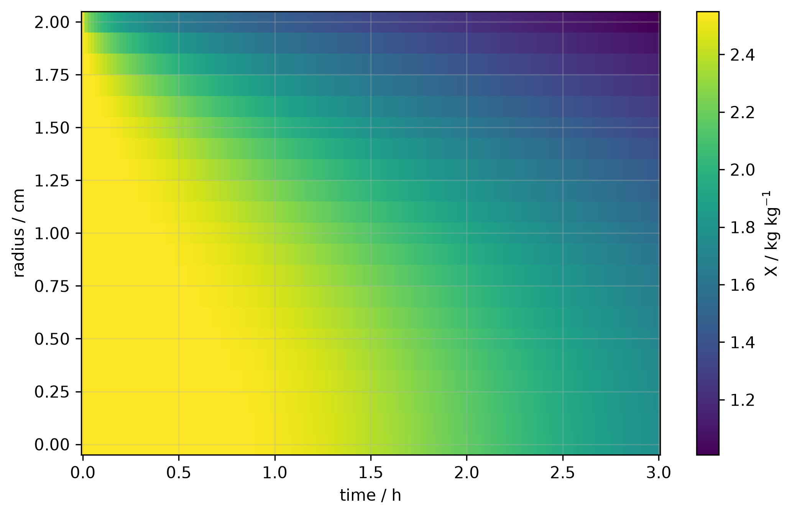</td>
</tr>
<tr>
<td align="center"><strong>固定半径工况前三小时温度场</strong></td>
<td align="center"><strong>固定半径工况前三小时含水率场</strong></td>
</tr>
</table>

固定半径完整过程中，表面含水率下降最快，中心含水率决定最终终止事件。

<table>
<tr>
<td width="50%">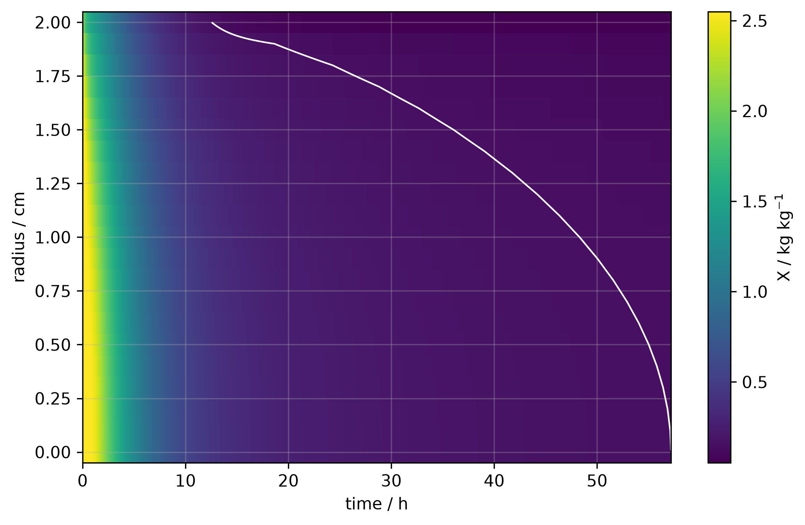</td>
<td width="50%">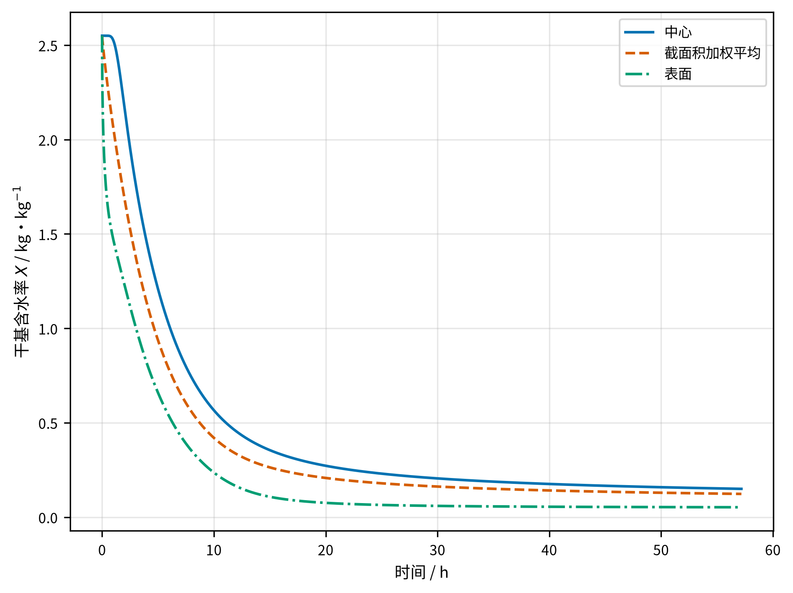</td>
</tr>
<tr>
<td align="center"><strong>固定半径完整含水率时空分布</strong></td>
<td align="center"><strong>中心、截面积加权平均和表面含水率</strong></td>
</tr>
</table>

<p align="center">
  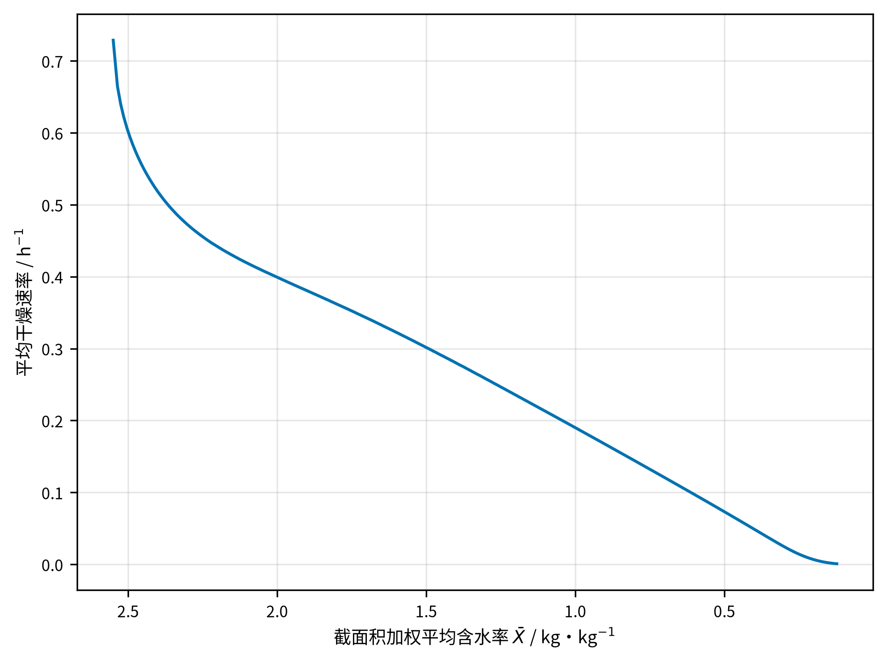
</p>
<p align="center"><strong>平均干燥速率随截面积加权平均含水率的变化</strong></p>

收缩工况同时在物理坐标和材料坐标下展示。图中的时空场由正式 $0.1\ \mathrm{cm}$ 物理采样结果重构，用于描述宏观分布，不等同于原始 $321$ 单元求解场。

<table>
<tr>
<td width="50%">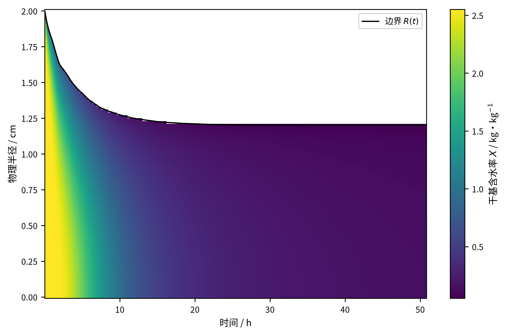</td>
<td width="50%">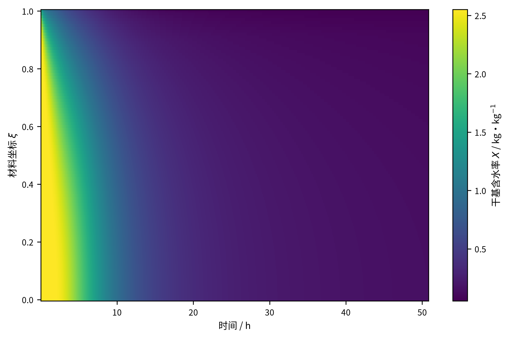</td>
</tr>
<tr>
<td align="center"><strong>物理坐标下的含水率分布与移动边界</strong></td>
<td align="center"><strong>材料坐标下的含水率分布</strong></td>
</tr>
</table>

<p align="center">
  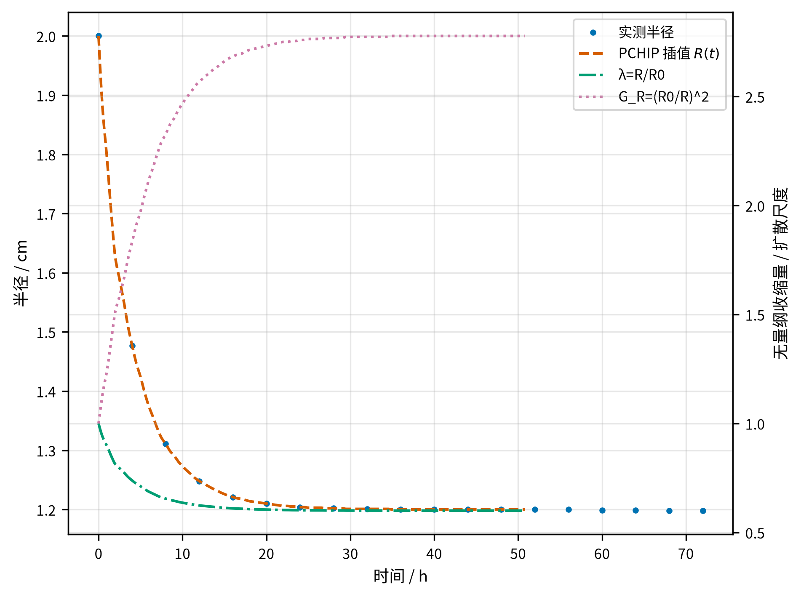
</p>
<p align="center"><strong>实测半径、收缩比与几何扩散尺度</strong></p>

<table>
<tr>
<td width="50%">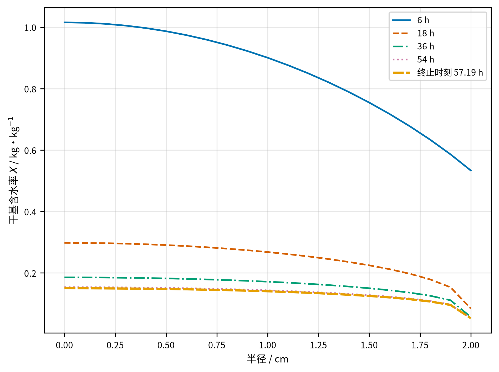</td>
<td width="50%">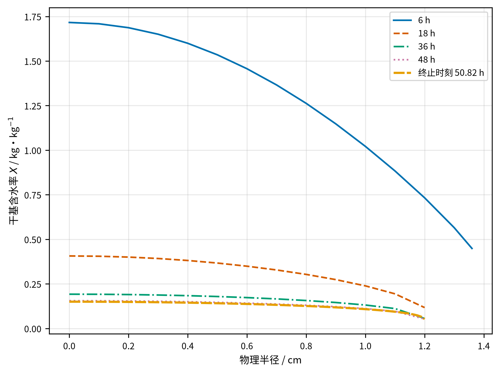</td>
</tr>
<tr>
<td align="center"><strong>固定半径工况的含水率径向剖面</strong></td>
<td align="center"><strong>收缩工况的含水率径向剖面</strong></td>
</tr>
</table>

## 数值验证

模型通过解析基准、物理约束、空间与时间收敛、环境水分势排序、积分通量闭合以及正式输出交叉核对进行验证。

| 工况 | 网格变化 | $\Delta t_{\mathrm{dry}}$ / s | $\max|\Delta T|$ / °C | $\max|\Delta X|$ |
|---|---|---:|---:|---:|
| 固定半径 | $161\rightarrow321$ | $-149.56$ | $2.329\times10^{-5}$ | $2.183\times10^{-4}$ |
| 固定半径 | $321\rightarrow641$ | $-52.59$ | $5.866\times10^{-6}$ | $8.154\times10^{-5}$ |
| 实测收缩 | $161\rightarrow321$ | $-25.87$ | $6.617\times10^{-5}$ | $1.780\times10^{-4}$ |
| 实测收缩 | $321\rightarrow641$ | $-7.54$ | $1.664\times10^{-5}$ | $4.471\times10^{-5}$ |

<p align="center">
  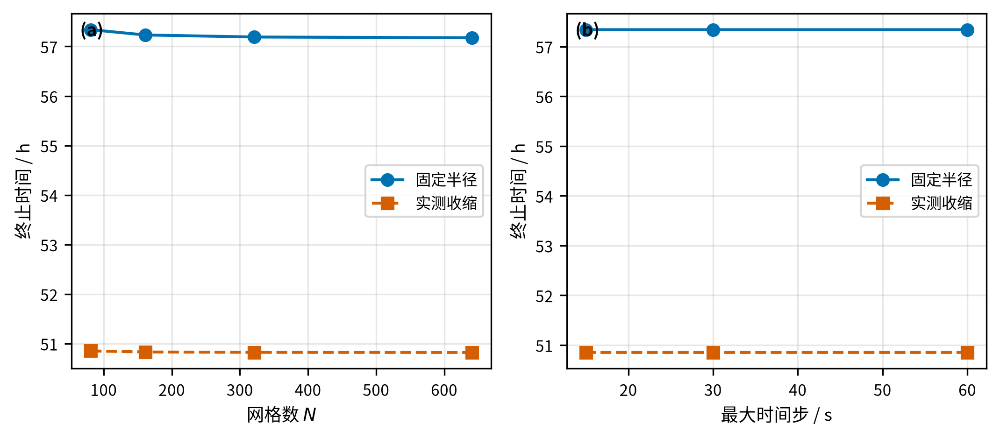
</p>
<p align="center"><strong>终止时间的空间网格与时间步收敛</strong></p>

最大时间步从 $60\ \mathrm{s}$ 减小到 $15\ \mathrm{s}$ 时，固定半径和实测收缩工况的终止时间分别变化 $0.26\ \mathrm{s}$ 和 $0.12\ \mathrm{s}$。事件定位误差远小于空间离散误差，因此连续事件值用于保证输出一致性，不表示模型具有相同小数位数的物理精度。

平均含水率与边界有效通量满足积分关系

$$
\bar X(t)-\bar X(0)
+
\int_0^t \frac{2h_m}{R(\tau)}
\left[X_s(\tau)-C_a(\tau)\right],\mathrm d\tau
=0.
$$

在 $N=81$、$0$–$12\ \mathrm{h}$ 的全时域检查中，固定半径和收缩工况相对总含水率变化的最大累计闭合误差分别为 $1.191\times10^{-5}$ 和 $1.298\times10^{-5}$；前 $4\ \mathrm{h}$ 的全部 $480$ 个积分区间均纳入检查。

## 敏感性与工艺情景

敏感性分析采用 $N=321$。换热系数 $h_T$ 改变 $\pm20\%$ 时，终止时间仅改变数十秒；传质系数 $h_m$ 减半使终止时间延长约 $7.45\ \mathrm{h}$；恒温阶段温度降低 $2\ ^\circ\mathrm C$ 使终止时间延长约 $3.80\ \mathrm{h}$。

<p align="center">
  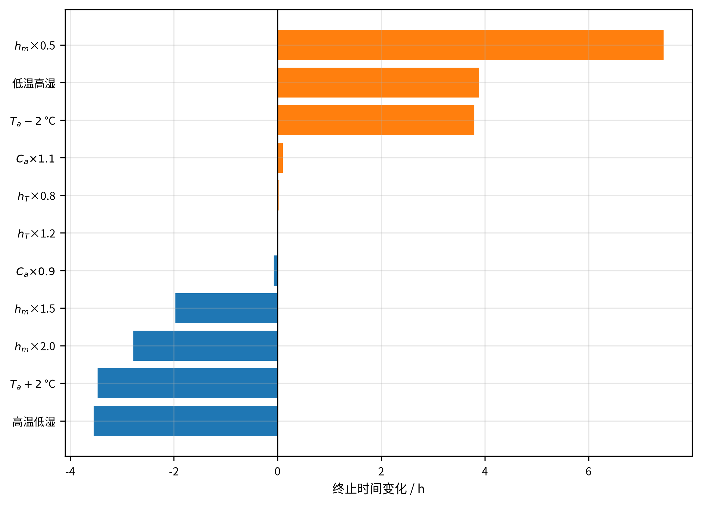
</p>
<p align="center"><strong>参数与环境情景对终止时间的影响</strong></p>

平台温度情景保持前 $4\ \mathrm{h}$ 实测过程不变，仅改变此后的恒温阶段设定值。在 $48$–$52\ ^\circ\mathrm C$ 范围内，平台温度由 $50.165\ ^\circ\mathrm C$ 提高到 $52\ ^\circ\mathrm C$，终止时间由 $57.1904\ \mathrm{h}$ 缩短至 $53.9942\ \mathrm{h}$，缩短 $3.1962\ \mathrm{h}$，相对降幅为 $5.59\%$。

终点截面积加权标准差定义为

$$
\sigma_X(t_f)=
\left[
\frac{2}{R^2}
\int_0^R \left(X-\bar X\right)^2r\,\mathrm dr
\right]^{1/2}.
$$

从实测平台到 $52\ ^\circ\mathrm C$，$N=321$ 和 $N=641$ 均给出 $\sigma_X$ 轻微下降，但代表温度下的最大网格差为 $1.106\times10^{-5}$，是 $N=321$ 温度信号的 $4.51$ 倍。因此该均匀性变化在当前空间分辨率下不可辨识。可靠结论是：升高平台温度显著缩短终止时间，未观察到含水率均匀性恶化，终点均匀性基本不变。

<p align="center">
  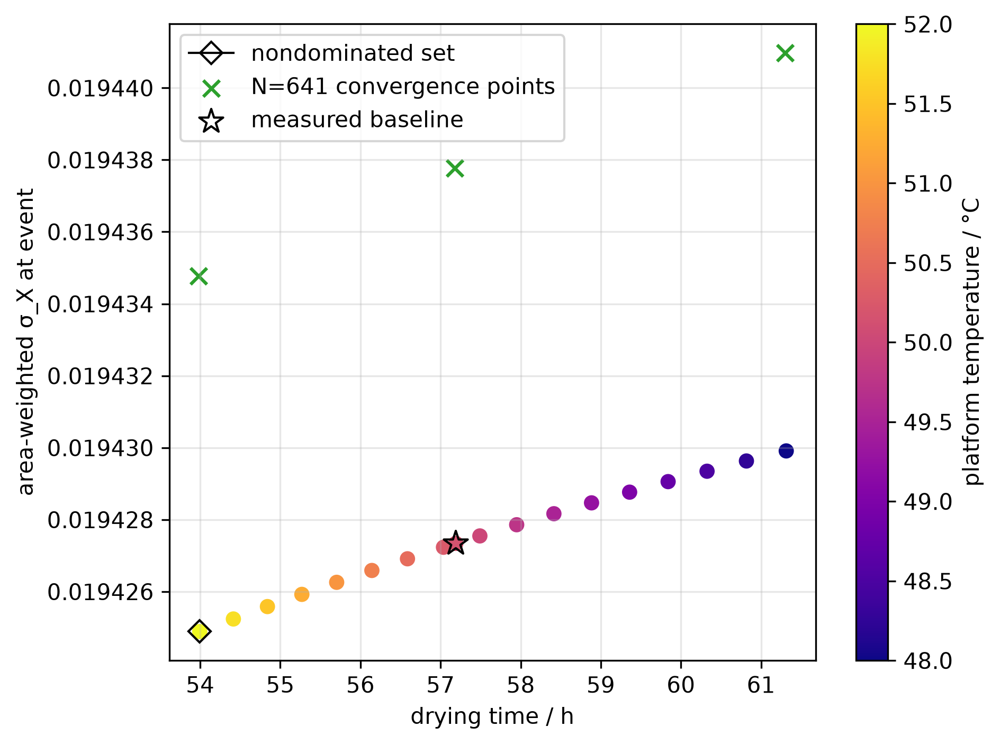
</p>
<p align="center"><strong>终止时间—终点含水率均匀性目标空间</strong></p>

考察区间内两项目标未表现出可辨识的竞争关系，非支配集合退化为 $52\ ^\circ\mathrm C$ 单点。该温度仅表示给定 $48$–$52\ ^\circ\mathrm C$ 区间内的最优情景。模型未包含有效成分热降解、色泽变化、挥发性成分损失、组织损伤和设备能耗，不能据此外推物理上的全局最优温度。温度情景限定于固定几何模型，因为现有实测收缩曲线不足以确定不同温度下的 $R(t;T_{\mathrm{plat}})$。

## 正式输出

| 文件 | 内容 | 数据行 | 时间范围 | 时间间隔 |
|---|---|---:|---:|---:|
| `data/附件3/result1.xlsx` | 预热阶段温度与含水率 | 1800 | $1$–$1800\ \mathrm{s}$ | $1\ \mathrm{s}$ |
| `data/附件3/result2.xlsx` | 固定半径完整温度与含水率 | 205885 | $1$–$205885\ \mathrm{s}$ | $1\ \mathrm{s}$ |
| `data/附件3/result3.xlsx` | 固定半径含水率 | 3431 | $60$–$205860\ \mathrm{s}$ | $60\ \mathrm{s}$ |
| `data/附件3/result4.xlsx` | 收缩工况含水率 | 3049 | $60$–$182940\ \mathrm{s}$ | $60\ \mathrm{s}$ |

精确终止事件及对应场保存在 `results/tables/q2_meta.json` 和 `results/tables/q4_meta.json`。`result3.xlsx` 与 `result4.xlsx` 仅保存严格早于连续终止事件的规则 $60\ \mathrm{s}$ 时间点。题目表 1–6 由 `src/generate_tables.py` 自动生成至 `results/tables/paper_table1.csv` 至 `paper_table6.csv`，其中表 5、表 6 的最后一行来自连续事件场。

## 环境配置

推荐使用 Python 3.11 和 Conda 环境：

```bash
conda create -n cumcm-a python=3.11 -y
conda activate cumcm-a
pip install -r requirements.txt
export PYTHONPATH=src
```

未激活环境时可使用：

```bash
export PYTHONPATH=src
conda run -n cumcm-a python src/model1.py
```

## 运行方法

生成四个正式结果：

```bash
python src/model1.py
python src/model2.py
python src/model3.py
python src/model4.py
```

生成题目表 1–6 并审计正式工作簿：

```bash
python src/generate_tables.py
python src/check_outputs.py
```

运行冻结后的指标验证、平台温度情景和可视化：

```bash
python src/quality_optimization.py
python src/validate_metrics.py --quality-grid --jobs 3
python src/visualize.py
python src/check_analysis.py
```

运行完整数值验证：

```bash
python src/validate.py
```

需要分别执行收敛与解析基准验证时，可使用：

```bash
python src/validate.py --grid-only --include-641
python src/validate.py --time-only
python src/validate.py --skip-grid --skip-time
```

## 项目结构

```text
.
├── data/
│   ├── 附件1.xlsx
│   ├── 附件2.xlsx
│   └── 附件3/result1~4.xlsx
├── results/
│   ├── figures/
│   └── tables/
├── src/
│   ├── props.py
│   ├── solver.py
│   ├── model1.py
│   ├── model2.py
│   ├── model3.py
│   ├── model4.py
│   ├── metrics.py
│   ├── sensitivity.py
│   ├── quality_optimization.py
│   ├── validate.py
│   ├── validate_metrics.py
│   ├── generate_tables.py
│   ├── check_outputs.py
│   ├── check_analysis.py
│   └── visualize.py
└── requirements.txt
```

所有长计算结果均带有输入内容指纹。代码、输入数据、网格或关键设置发生变化时，旧缓存自动失效；正式文件采用临时文件与原子替换，避免中断写入被误认为完整结果。
